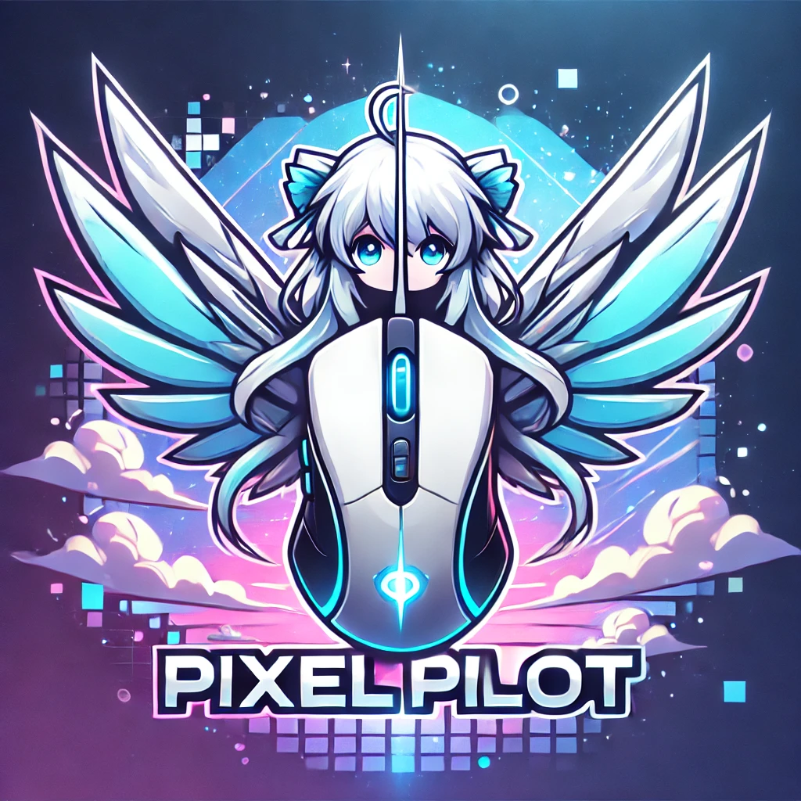

<p align="center">
  
</p>

# PixelPilot

PixelPilot is an AI-driven system that integrates both terminal-based actions and GUI-driven (visual) operations to automate computer tasks. Through its dual-path design, it intelligently decides whether to perform terminal commands or visual interactions (mouse, keyboard, window capture, etc.), all while maintaining a shared state for guidance and context. Additionally, PixelPilot incorporates a graph-based workflow engine, dynamic action tools, state management, and flexible profile-driven instructions.

## Table of Contents
1. Introduction
2. Features
   - Dual-Path Architecture
   - Graph-based Workflow Engine
   - Tools and Actions
   - State Management
   - Audio Capture (Optional)
3. Installation
   - Requirements
   - Installation
4. Usage
   - Running PixelPilot
   - Profiles
   - Terminal vs. GUI

---

## 1. Introduction

PixelPilot is designed to automate computer interactions in two modes:
• Terminal-based tasks, such as creating files, listing directory contents, or other shell commands.  
• Visual (GUI) tasks, such as clicking buttons in a browser, scrolling through pages, and interacting with graphical dialogs.

Instead of forcing all tasks through a single approach, PixelPilot picks the most appropriate mode based on the assigned workflow. The system also supports path-specific controllers (e.g., Docker-based GUI, Native GUI) to facilitate running in various environments, including containers or local operating systems.

---

## 2. Features

### Dual-Path Architecture
• Terminal Path: Leverages Python's subprocess or direct shell invocation to run commands, capture output, and manage file operations.  
• Visual Path: Uses PyAutoGUI, X11, or Docker-based tools (depending on environment) to simulate keyboard/mouse actions, capture screenshots, locate GUI elements, and perform clicks or scroll actions.

### Graph-based Workflow Engine
• The "graph_system" folder defines a powerful mechanism to define tasks as a directed graph.  
• Each node in the graph can specify a different stage of the workflow (e.g., "start," "ask user," "run command," "visual confirm," "end").  
• This makes complex tasks easier to structure, evaluate, and debug.

### Tools and Actions
• Tools are modules (like "KeyboardTool," "MouseTool," "TerminalTool") that encapsulate specific capabilities.  
• Each tool has methods such as "execute_command" for terminal actions or "click," "scroll," etc. for mouse/keyboard interactions.  
• The "models.py" and "action_types.py" define standardized data structures (Action, ActionResponse) that unify how the system interprets and responds to instructions.  

### State Management
• The "state_management.py" module holds a "SharedState" TypedDict to maintain a consistent state across path switches.  
• This shared state tracks the user's task description, action history, and any relevant context needed for transitions between the terminal path and the visual path.

### Audio Capture (Optional)
• The "audio_capture.py" file provides optional audio recording functionality using sounddevice. This can be useful for tasks requiring audio context or placeholders for speech input.
(Not sure if this still works after recent refactor.)

---

## 3. Installation

### Requirements
• Python 3.12 or above  
• Additional Python packages (as listed in pyproject.toml) such as pyautogui, openai, opencv-python, etc.  
• For GUI interaction in Docker-based contexts, an environment configured with X11 or a VNC server is required.  
• For local usage, ensure you have the necessary system dependencies (e.g. pillow, pyautogui, etc.).

### Installation
1. Clone this repository:  
   git clone https://github.com/cipher982/pixel-pilot.git

2. Navigate into the repository folder and install the required dependencies:  
   pip install uv
   uv sync

3. (Optional) If you plan to run Docker-based GUI tasks, see the "eval/docker" directory for Dockerfile and run scripts.

---

## 4. Usage

### Running PixelPilot
Once installed, you can run it like the following examples:

```
uv run python -m pixelpilot.main -i "whats the free space on my disk?"
```

```
uv run python -m pixelpilot.main -i "create a new directory called 'jokes' with a new file in it, add a pun to the file, and then print the size of the file"
```

```
uv run python -m pixelpilot.main -i "open a new browser tab and navigate to https://www.google.com"
```

### Running Tests
PixelPilot's test suite can be run either natively or within Docker:

**Native Testing**
```bash
uv run pytest tests/
```

**Docker Testing**
```bash
./launch_eval.sh test
```

The Docker-based testing environment is particularly useful for GUI-related tests or ensuring consistent test behavior across different environments.

### Profiles
*In process of deprecating this, try out the interactive mode for now! (`-i` flag)*

~~PixelPilot comes with various profiles in the "profiles" directory. A profile describes instructions for specific scenarios, such as:  
• quiz_debug.yml, training.yml, training_course.yml for quiz and training tasks  
• aws_login.yml for AWS Single Sign-On flow  
• review_scraper.yml, review_browser.yml for scraping product reviews~~

~~You can reference or load a profile that modifies how the state machine or tools operate. Each profile may contain instructions describing how to navigate a quiz or perform specific tasks.~~

### Terminal vs. GUI
Depending on the user's request, PixelPilot can switch to the "terminal" path or "visual" path. For example:  
• The "terminal" path might run a command like "mkdir" or "touch test.txt".  
• The "visual" path could open your web browser and navigate to a specific page.

A typical usage scenario:  
1. The system's logic or user's preference picks a path.  
2. PixelPilot either runs the command line or uses the GUI control (Docker or Native).  
3. The shared state is updated based on the outcome.  
4. If another sub-task requires switching paths, PixelPilot transitions seamlessly.
